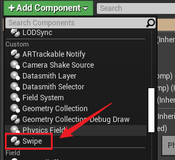
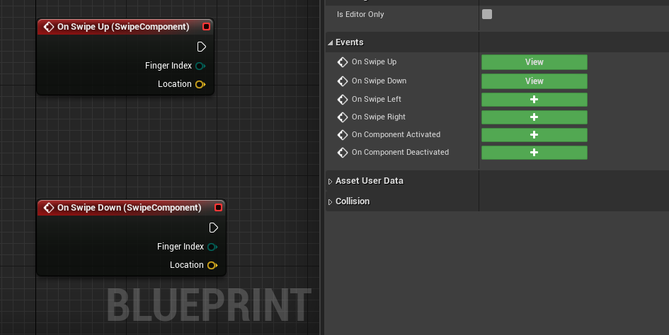

# MobileSwipeComponent

a component for actor, which allows actor to respond to swipes on viewport.<br/>一个ActorComponent类，可以响应上下左右滑动触控操作，用于虚幻移动设备输入

## How to use 使用方法
### C++
1. Creat SwipeComponent in the constructor.</br>在需要响应输入的Actor的构造函数中创建组件
```C++
SwipeComponent = CreateDefaultSubobject<USwipeComponent>(TEXT("TouchComp"));
```
2. Creat a response function(UFunction) for swipe operation.</br>创建响应滑动操作的UFunction
```C++
// the example for left swipe
UFUNCTION()
void TouchSwipeLeft(ETouchIndex::Type FingerIndex, FVector Location);
```
3. Bind UFunction.</br>绑定响应滑动操作的UFunction
```C++
SwipeComponent->OnSwipeLeft.AddDynamic(this, &UYourActorClass::TouchSwipeLeft);
```
4. Then you can do what you wanna to do in your function!</br>大功告成，然后你就可以写对应的逻辑了！
### BluePrint 蓝图
~~Damn, I almost forgot the blueprint!~~</br>~~玛德，差点把蓝图给忘了！~~
1. Add the Swipe component to the BP of Actor.</br>把Swipe插件添加到Actor的蓝图</br>

3. Add events to the graph and connect them to your nodes.</br>添加你需要的事件，连接到对应的节点</br>

## P.s. 附言
Trying to update. mail me, any questions.</br>持续更新中，有问题发邮件问我
